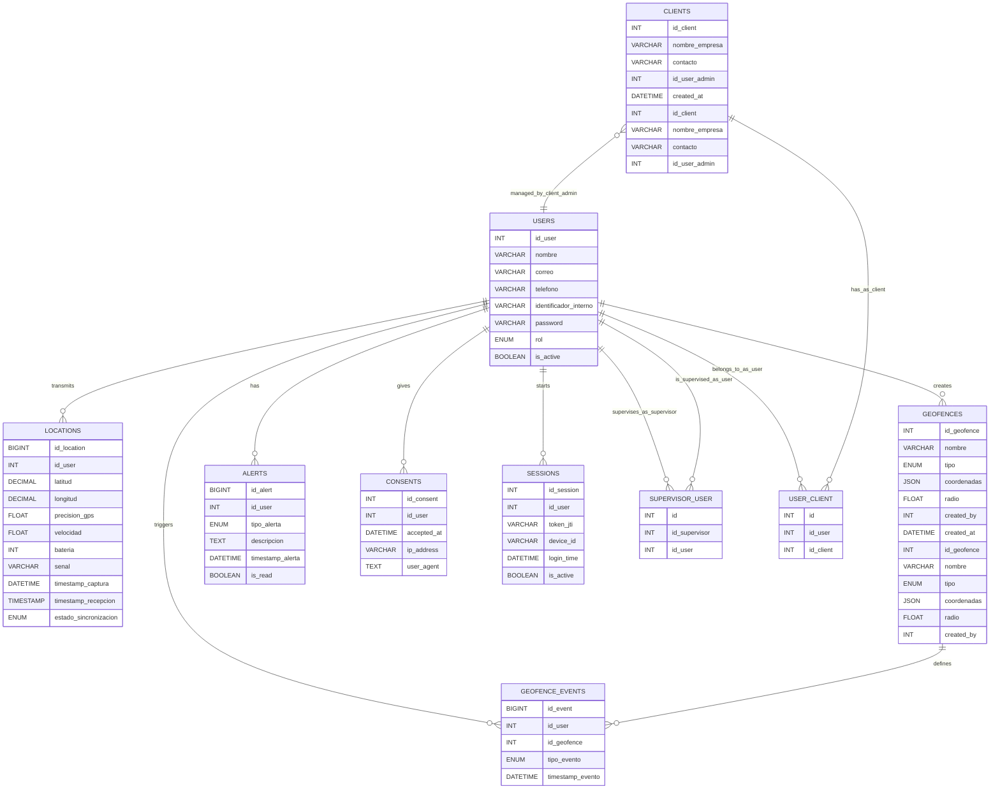

# Capa de Acceso a Datos

## Herramientas de conexión
- **MySQL2**: Librería utilizada para establecer el pool de conexiones.
- **Transacciones SQL**: Se emplean para asegurar que los lotes de ubicaciones (sincronización offline) se guarden de forma atómica.

## Entidades principales (Basadas en `schema.sql`)

1. **`Users`**: Usuarios registrados con roles (ADMIN, SUPERVISOR, CLIENT, USER). PK: `id_user`.
2. **`Clients`**: Empresas u organizaciones. PK: `id_client`. Contiene `nombre_empresa` e `id_user_admin`.
3. **`User_Client`**: Relación entre un usuario rastreado (USER) y un cliente (CLIENT).
4. **`Supervisor_User`**: Asignación de usuarios a supervisores para su monitoreo.
5. **`Locations`**: Historial de coordenadas. Campos clave: `latitud`, `longitud`, `velocidad`, `bateria`, `timestamp_captura`, `estado_sincronizacion`.
6. **`Geofences`**: Zonas virtuales (CIRCLE o POLYGON). Coordenadas almacenadas como JSON.
7. **`Geofence_Events`**: Registro histórico de entradas y salidas de geocercas.
8. **`Alerts`**: Alertas críticas (BATTERY_LOW, SIGNAL_LOST, GEOFENCE_ENTER, etc.).
9. **`Consents`**: Registro de aceptación legal. Campos: `accepted_at`, `ip_address`, `user_agent`.
10. **`Sessions`**: Control de sesiones activas por dispositivo mediante `token_jti`.

## Diagrama entidad-relación

