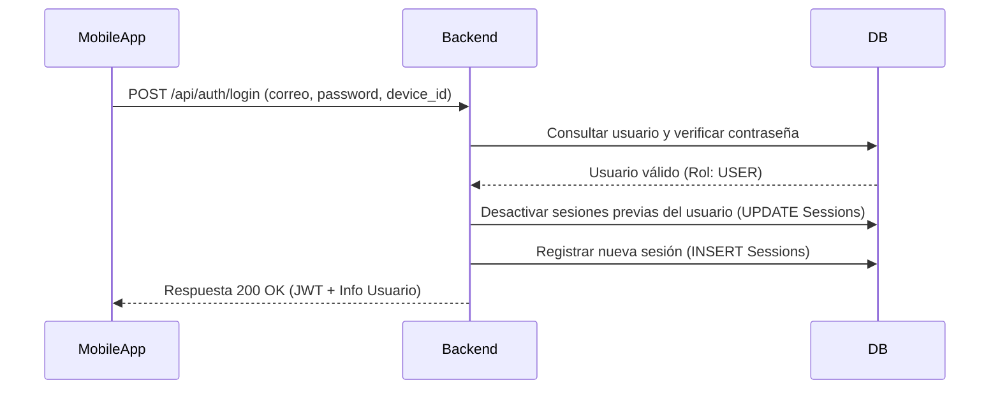
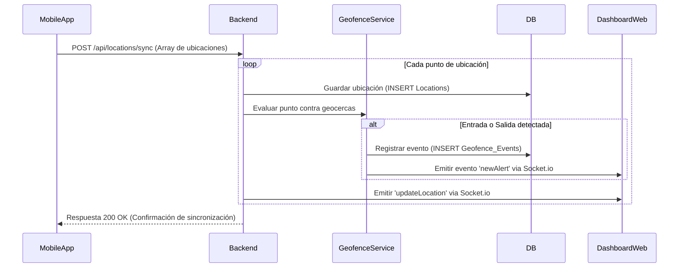

# Actores y Diagramas

## Roles de usuario

El sistema define roles específicos con permisos diferenciados sobre la información y las acciones disponibles.

| Rol | Descripción | Permisos Principales |
| :--- | :--- | :--- |
| **`ADMIN`** | Administrador del sistema global. | Control total (CRUD) de usuarios, clientes, geocercas y reportes. |
| **`SUPERVISOR`** | Personal de monitoreo operativo. | CRUD (Crear, Leer, Actualizar, Eliminar) de los usuarios que tiene asignados. |
| **`CLIENT`** | Representante de una empresa (cliente). | Ver y gestionar al personal y reportes asociados a su organización. |
| **`USER`** | Usuario rastreado (conductor/operario). | Transmitir ubicación, aceptar consentimiento y ver su propio estado. |

## Diagramas de Secuencia (Inferidos)

### Flujo de Inicio de Sesión y Control de Dispositivo (Rol USER)

### Flujo de Sincronización de Ubicaciones Offline

